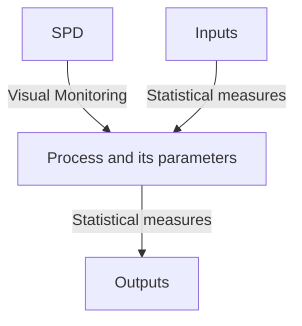

# ⏰ Statistical-Process-Control-Rational-Subgrouping-in-Six-Sigma
This repository provides the information on Statistical Process Control and Rational Subgrouping

---

## 🏺 Statistical Process Control (SPC)
SPC is a quality control method that uses statistical techniques to monitor and control a process. It ensures that the process operates efficiently, producing consistent, high-quality output with minimal variation. Walter A Stewart developed Statistical Process Control (SPC) in 1924



### Benefits of SPC
- It separates special causes of variability and common causes of variability
- It recognizes unexpected changes in the process output
- It identifies stable zone variables with unknown specification limits
- It provides useful external information like continuous process improvement and online monitoring

---

## 🔋 Features of Common Cause variation
The common cause variation is that which can be usually seen in the process
- Small variations in raw materials
- Variations due to manual interventions in manual process
- Responses from machines or systems etc.
- Should be within tolerance/specification limits
- Will be the part of process

  ```mermaid
  flowchart TD;
  A[High frequency] --> B[High predictability];
  C[Repetitive] --> D[Huge investment and time to identify & remove them];
  ```

  ---

  ## 🪣 Features of Special Cause Variation
  The special cause variation is the variation that cannot be normally seen in the process
  - Machine or system crash
  - Delay in supply of raw materials
  - Huge variations in the raw materials, etc.
  - Variation affects the flow of the process due to which the defects appear

  ```mermaid
  flowchart TD;
  A[Low Frequency] --> B[Low Predictability];
  C[Non-repetitive] --> D[Less investment and time to identify & remove them];
  ```

  ---
