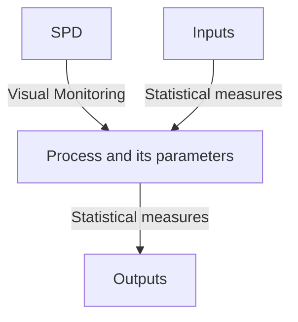

# ⏰ Statistical-Process-Control-Rational-Subgrouping-in-Six-Sigma
This repository provides the information on Statistical Process Control and Rational Subgrouping

---

## 🏺 Statistical Process Control (SPC)
SPC is a quality control method that uses statistical techniques to monitor and control a process. It ensures that the process operates efficiently, producing consistent, high-quality output with minimal variation. Walter A Stewart developed Statistical Process Control (SPC) in 1924



### Benefits of SPC
- It separates special causes of variability and common causes of variability
- It recognizes unexpected changes in the process output
- It identifies stable zone variables with unknown specification limits
- It provides useful external information like continuous process improvement and online monitoring

---

## 🔋 Features of Common Cause variation
The common cause variation is that which can be usually seen in the process
- Small variations in raw materials
- Variations due to manual interventions in manual process
- Responses from machines or systems etc.
- Should be within tolerance/specification limits
- Will be the part of process

  ```mermaid
  flowchart TD;
  A[High frequency] --> B[High predictability];
  C[Repetitive] --> D[Huge investment and time to identify & remove them];
  ```

  ---

  ## 🪣 Features of Special Cause Variation
  The special cause variation is the variation that cannot be normally seen in the process
  - Machine or system crash
  - Delay in supply of raw materials
  - Huge variations in the raw materials, etc.
  - Variation affects the flow of the process due to which the defects appear

  ```mermaid
  flowchart TD;
  A[Low Frequency] --> B[Low Predictability];
  C[Non-repetitive] --> D[Less investment and time to identify & remove them];
  ```

  ---

## 🕹 Subgroup
A collection of units that are produced or created under the same set of conditions

### Rational subgroups
- Represents the process at a particular point in time
- Measurements must be taken within a short span of time but should also be independent of each other

|*Approach 1*|*Approach 2*|
|-------------|-----------|
|Sample -> Every other group of 10 consecutive units| Sample -> Random for all process o/p over the sampling interval|
|- used to detect process shifts|-Used to make decisions about the acceptance of a product|
|- A process shift happens overtime and is reflected in variation of the o/p variables|- detecting the shifts of the o/p variable to an out of control state and back into an in-control state between samples|
|Eg. Process -> 10 consecutive units -> everyone group|Eg: Process -> 100 parts per hour -> 5 randomly selected parts every hour|

### Rational Subgrouping
Rational subgrouping refers to the solution of subgroups or samples in a way that if special causes are present, chances for differeces between subgroups will be maximized and chance for differences due to assignable causes within a subgroups will be minimized
- The interval bars represent the within subgroup variation
- In the graph, it connects the averages of the consecutive subgroups represneting the subgroup variation

---

*"Any fool can know. The point is to understand"* - Albert Einstein
